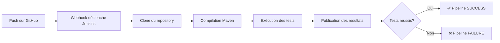

# 🚀 Demo Jenkins Pipeline - Intégration Continue avec Maven

[](https://www.jenkins.io/)
[](https://maven.apache.org/)
[](https://www.java.com/)

> Projet réalisé dans le cadre du **TD2 - Intégration d'un pipeline Jenkins à partir d'un dépôt GitHub**  
> Par **Fieni Dannie Innocent Junior** - MCS 26.2 Cybersécurité & Cloud Computing  
> IPSSI Nice - 2025

---

## 📖 Description

Ce projet démontre la mise en place d'une chaîne d'**intégration continue (CI)** avec Jenkins, en utilisant :
- Un projet Java avec Maven
- Des tests unitaires avec JUnit 5
- Un Jenkinsfile pour l'automatisation
- La publication des résultats de tests dans Jenkins

---

## 🎯 Objectifs pédagogiques

- ✅ Créer et structurer un projet Maven sur GitHub
- ✅ Écrire un Jenkinsfile fonctionnel
- ✅ Configurer Jenkins pour exécuter un pipeline automatiquement
- ✅ Visualiser les résultats de tests dans Jenkins
- ✅ Comprendre les étapes d'un pipeline CI/CD

---

## 🏗️ Structure du projet

```
demo-jenkins-pipeline/
├── src/
│   ├── main/
│   │   └── java/
│   │       └── App.java              # Classe principale avec méthode add()
│   └── test/
│       └── java/
│           └── AppTest.java          # Tests JUnit
├── pom.xml                            # Configuration Maven
├── Jenkinsfile                        # Pipeline Jenkins
├── .gitignore                         # Fichiers à ignorer par Git
└── README.md                          # Ce fichier
```

---

## 🔧 Prérequis

### Logiciels nécessaires
- **Jenkins** (version LTS recommandée)
- **Maven 3.8+** configuré dans Jenkins
- **JDK 11+**
- **Git**
- **Un compte GitHub**

### Configuration Jenkins requise
1. Jenkins installé et accessible (ex: http://localhost:8080)
2. Maven configuré dans **Manage Jenkins → Tools → Maven installations**
   - Nom : `Maven 3.9`
   - Installation automatique activée

---

## 📦 Installation et configuration

### 1️⃣ Cloner le repository

```bash
git clone https://github.com/JuFiSec/demo-jenkins-pipeline.git
cd demo-jenkins-pipeline
```

### 2️⃣ Tester localement (optionnel)

```bash
# Compiler le projet
mvn clean compile

# Exécuter les tests
mvn test

# Les résultats seront dans target/surefire-reports/
```

### 3️⃣ Configurer le job Jenkins

1. **Créer un nouveau job Pipeline**
   - Nom : `demo-jenkins-pipeline`
   - Type : **Pipeline**

2. **Configuration du Pipeline**
   - Definition : `Pipeline script from SCM`
   - SCM : `Git`
   - Repository URL : `https://github.com/JuFiSec/demo-jenkins-pipeline.git`
   - Branch Specifier : `*/main`
   - Script Path : `Jenkinsfile`

3. **Sauvegarder et lancer**
   - Cliquer sur **Build Now**

---

## 🔍 Détails du Jenkinsfile

Le pipeline se compose de 4 étapes principales :

### Stage 1 : Checkout
```groovy
stage('Checkout') {
    steps {
        echo 'Clonage du dépôt GitHub...'
        checkout scm
    }
}
```
→ Clone automatiquement le code depuis GitHub

### Stage 2 : Compile & Test
```groovy
stage('compile & test') {
    steps {
        echo 'Compilation et tests avec Maven...'
        sh 'mvn clean compile'
    }
}
```
→ Compile le code Java avec Maven

### Stage 3 : Build & Test
```groovy
stage('Build & Test') {
    steps {
        echo 'Compilation et tests avec Maven...'
        sh 'mvn test' 
    }
}
```
→ Exécute les tests JUnit

### Stage 4 : Publish Results
```groovy
stage('Publish Results') {
    steps {
        echo 'Publication des résultats...'
        junit '**/target/surefire-reports/*.xml'
    }
}
```
→ Publie les résultats des tests dans Jenkins

### Bloc post
```groovy
post {
    success {
        echo '✅ SUCCÈS !'
    }
    failure {
        echo '❌ ÉCHEC'
    }
}
```
→ Affiche le statut final du pipeline

---

## 📊 Résultats attendus

Après l'exécution du pipeline, vous devriez voir :

✅ **Console Output** :
```
[Pipeline] stage
[Pipeline] { (Checkout)
Clonage du dépôt GitHub...
[Pipeline] checkout
...
[Pipeline] stage
[Pipeline] { (Build & Test)
[INFO] Tests run: 1, Failures: 0, Errors: 0, Skipped: 0
[INFO] BUILD SUCCESS
...
✅ SUCCÈS !
Finished: SUCCESS
```

✅ **Test Result** (onglet dans Jenkins) :
- 1 test passé
- 0 échec
- Détails du test `AppTest.testAdd()`

---

## 🧪 Description des tests

### AppTest.java
```java
@Test
void testAdd() {
    assertEquals(3, App.add(1, 2));
}
```

Ce test vérifie que la méthode `add()` de la classe `App` :
- Prend deux entiers en paramètres (1 et 2)
- Retourne leur somme (3)
- Assertion : `assertEquals(3, App.add(1, 2))`

---

## 🔄 Workflow CI/CD



---

## 🛠️ Dépannage

### Problème : "mvn: command not found"
**Solution** : Vérifiez que Maven est bien configuré dans Jenkins
1. Manage Jenkins → Tools
2. Maven installations → Ajouter Maven
3. Nom : `Maven 3.9`

### Problème : "No test results found"
**Solution** : Vérifiez que les tests sont exécutés
```bash
# Dans le workspace Jenkins
ls -la target/surefire-reports/
```

### Problème : Pipeline échoue au stage "Checkout"
**Solution** : Vérifiez l'URL du repository GitHub
- Doit être accessible publiquement
- Format : `https://github.com/username/repo.git`

---

## 📚 Concepts clés

### Pipeline déclaratif
Un pipeline Jenkins structuré avec des sections clairement définies :
- `agent` : Où exécuter le pipeline
- `tools` : Outils nécessaires (Maven, JDK, etc.)
- `stages` : Étapes séquentielles du pipeline
- `post` : Actions après l'exécution

### Intégration Continue (CI)
Pratique qui consiste à :
1. Intégrer fréquemment le code dans un repository partagé
2. Automatiser la compilation et les tests
3. Détecter rapidement les erreurs

### Maven
Outil de gestion de projet Java qui :
- Gère les dépendances
- Compile le code
- Exécute les tests
- Génère des rapports

---

## 📈 Améliorations possibles

- [ ] Ajouter plus de tests unitaires
- [ ] Intégrer SonarQube pour l'analyse de code
- [ ] Ajouter un stage de packaging (JAR)
- [ ] Déployer l'artefact sur un serveur
- [ ] Ajouter des notifications (email, Slack)
- [ ] Mettre en place des webhooks GitHub

---

## 📝 Licence

Ce projet est réalisé à des fins pédagogiques dans le cadre de la formation MCS 26.2 à IPSSI Nice.

---

## 👤 Auteur

**Fieni Dannie Innocent Junior**  
MCS 26.2 - Cybersécurité & Cloud Computing  
IPSSI Nice - 2025

[](https://github.com/JuFiSec)

---

## 🙏 Remerciements

- IPSSI Nice pour la formation
- La communauté Jenkins pour la documentation
- Les contributeurs des projets open source utilisés

---

**Date de création** : Octobre 2025  
**Dernière mise à jour** : Octobre 2025